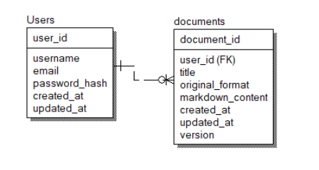



**UNIVERSIDAD PRIVADA DE TACNA FACULTAD DE INGENIERÍA** 

**Escuela Profesional de Ingeniería de Sistemas** 

***Desarrollo de un Sistema de Conversión y \
Organización de Documentos Técnicos en \
Markdown con Estructuración Automática y Control de Versiones para los estudiantes en la facultad de Ingeniería de Sistemas***

Curso: *Patrones de Software* \
Docente: Ing. Patrick Jose Cuadros Quiroga 

Integrantes: 

**Chambi Cori, Jerson Roni Flores Quispe, Jaime Elias Leyva Sardon, Elvis Ronald** 

**(2021072619) (2021070309) (2021072614)** 

**Tacna – Perú 2025** 

***Sistema de Conversión y Organización de Documentos Técnicos en Markdown con Estructuración Automática y Control de Versiones para los estudiantes en la facultad de Ingeniería de Sistemas*** 

**Diccionario de Datos** 

**Versión *1.0*** 

**ÍNDICE GENERAL** 

1. [**Modelo Entidad / relación**  4 ](#_page3_x55.00_y104.04)
1. [**Diseño lógico**  4 ](#_page3_x55.00_y127.04)
1. [**Diseño Físico**  4 ](#_page3_x55.00_y446.04)
2. [**DICCIONARIO DE DATOS**  4 ](#_page4_x55.00_y50.04)

**2.1.  [Tablas**  4 ](#_page4_x55.00_y77.04)**

1. **Procedimientos Almacenados**  4 
1. **Lenguaje de Definición de Datos (DDL)**  5 
1. **Lenguaje de Manipulación de Datos (DML)**  5 

**Diccionario de Datos** 

1. **Modelo Entidad / relación** 
1. **Diseño lógico** 

2. **Diseño Físico** 

2. **DICCIONARIO DE DATOS** 
1. **Tablas** 

|**Nombre de la Tabla:** |USERS ||||||
| - | - | :- | :- | :- | :- | :- |
|**Descripción de la Tabla:** |REGISTRO DE USUARIOS DEL SISTEMA. ||||||
|` `**Objetivo:** |ALMACENAR CREDENCIALES Y DATOS BÁSICOS PARA LA GESTIÓN DE DOCUMENTOS. ||||||
|**Relaciones con otras Tablas:** |DOCUMENTS ||||||
|**Descripción de los campos** |||||||
|**Nr o.** |
**Nombre del** 

**campo** 
|**Tipo datolongitud** |
**Permit**

**e nulo s** 
|**Clave primaria** |**Clave foránea** |**Descripción del campo** |
|1|user\_id|INT (IDENTITY)|No|Sí|No|Identificador único del usuario|
|2|username|VARCHAR(50)|No|No|No|Nombre de usuario|
|3|email|VARCHAR(100)|No|No|No|Correo electrónico|
|4|password\_h ash|VARCHAR(255)|No|No|No|Contraseña encriptada|
|5|created\_at|DATETIME|No|No|No|Fecha de creación del registro|
|6|updated\_at|DATETIME|No|No|No|Fecha de última actualización|

|**Nombre de la Tabla:** |DOCUMENTS||||||
| - | - | :- | :- | :- | :- | :- |
|**Descripción de la Tabla:** |ALMACENA DOCUMENTOS CARGADOS POR LOS USUARIOS.||||||
|` `**Objetivo:** |GESTIONAR ARCHIVOS EN DIFERENTES FORMATOS, ALMACENANDO CONTENIDO ESTRUCTURADO EN MARKDOWN. ||||||
|**Relaciones con otras Tablas:** |USERS ||||||
|**Descripción de los campos** |||||||
|**Nro.** |
**Nombre del**

**campo** 
|**Tipo dato longitud** |
**Permit**

**e nulo s** 
|**Clave primaria** |**Clave foránea** |**Descripción del campo** |
|1|document\_i d|INT (IDENTITY)|No|Sí|No|ID único del documento|
|2|user\_id|INT|No|No|Sí|Relación con el usuario propietario (users)|
|3|title|VARCHAR(255)|No|No|No|Título del documento|
|4|original\_for mat|VARCHAR(20)|No|No|No|Formato original del documento (PDF, DOCX, etc.)|
|5|markdown\_ content|TEXT|Sí|No|No|Contenido del documento en formato markdown|
|6|created\_at|DATETIME|No|No|No|Fecha de creación del documento|
|7 |updated\_at |DATETIME |No |No |No |Fecha de última actualización |
|8 |version |INT |Sí |No |No |Versión del documento |

2. **Procedimientos Almacenados** 
2. **Lenguaje de Definición de Datos (DDL) CREATE DATABASE y USE** 

-- Tabla de usuarios CREATE DATABASE DocMark; USE DocMark; 

CREATE TABLE users ( 

`    `user\_id INT PRIMARY KEY IDENTITY(1,1),     username VARCHAR(50) NOT NULL, 

`    `email VARCHAR(100) NOT NULL, 

`    `password\_hash VARCHAR(255) NOT NULL,     created\_at DATETIME DEFAULT GETDATE(),     updated\_at DATETIME DEFAULT GETDATE() ); 

-- Tabla de documentos 

CREATE TABLE documents ( 

`    `document\_id INT PRIMARY KEY IDENTITY(1,1), 

`    `user\_id INT FOREIGN KEY REFERENCES users(user\_id),     title VARCHAR(255) NOT NULL, 

`    `original\_format VARCHAR(20) NOT NULL,  

`    `markdown\_content TEXT, 

`    `created\_at DATETIME DEFAULT GETDATE(), 

`    `updated\_at DATETIME DEFAULT GETDATE(), 

` `version INT NULL 

);

4. **Lenguaje de Manipulación de Datos (DML)** 

INSERT INTO users (username, email, password\_hash)  

VALUES ('Jaime', 'jaime.doe@example.com', '$2b$12$40EHCl91BqgJsvJ8XAXwzuoZ4sGze4pCroHcjqM6W419UNJtDrXtK'),        ('Yoelito', 'yoelito.smith@example.com', '$2b$12$40EHCl91BqgJsvJ8XAXwzuoZ4sGze4pCroHcjqM6W419UNJtDrXtK'),     ('Elvicito', 'elvicito.smith@example.com', '$2b$12$40EHCl91BqgJsvJ8XAXwzuoZ4sGze4pCroHcjqM6W419UNJtDrXtK'); 

INSERT INTO documents (user\_id, title, original\_format, markdown\_content)  

VALUES (1, 'Sample Document 1', 'DOC', 'This is the content of the document in markdown format.'),  

`       `(2, 'Sample Document 2', 'DOCX', 'Another markdown content here.'), 

`    `(3, 'Sample Document 3', 'DOCX', 'Another markdown content here.');
